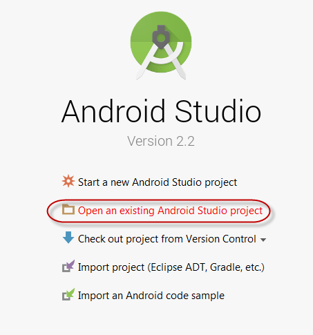
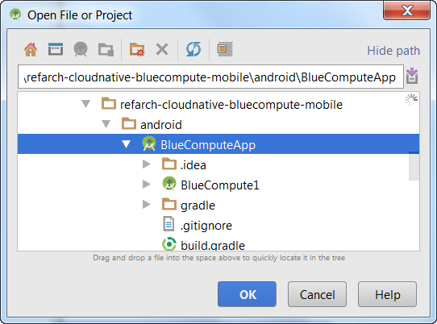
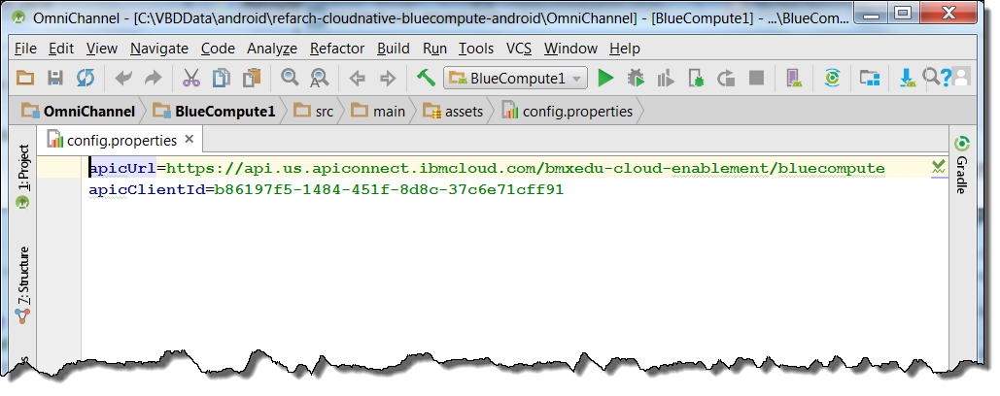
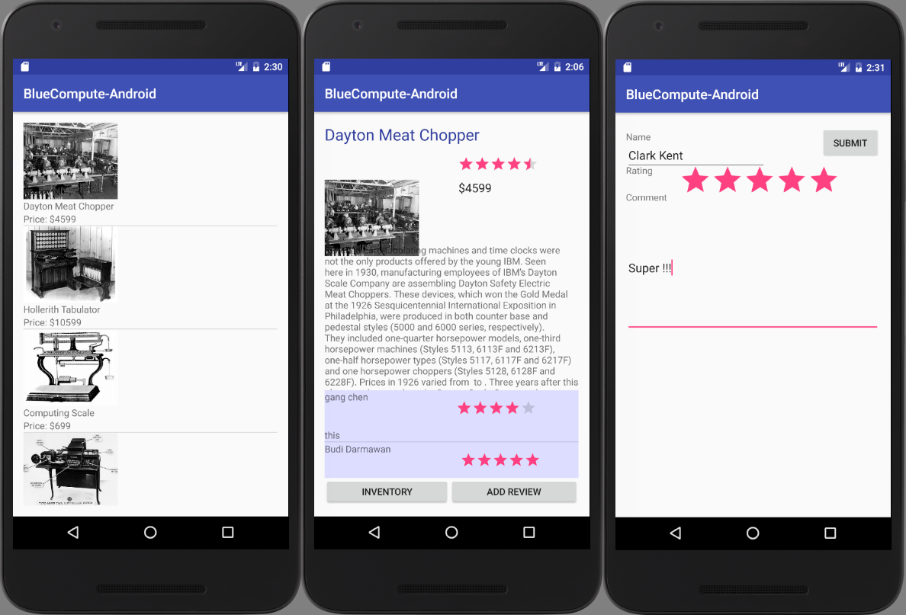

# BlueCompute Mobile Application by IBM Cloud

*This project is part of the 'IBM Cloud Native Reference Architecture' suite, available at
https://github.com/ibm-cloud-architecture/refarch-cloudnative*


The BlueCompute app consists of an iOS and Android version. The iOS application is developed in Swift 3.0 with support for older versions. The mobile apps were built to demonstrate the following capability on IBM Cloud:

 - Access the omnichannel enabled APIs through IBM API Connect on Bluemix
 - OAuth implementation using IBM API Connect as OAuth provider
 - Integration with IBM Bluemix Mobile Analytics


## Run the iOS application

Note this section requires an Apple computer running MacOS with Apple Xcode IDE installed.

**First, install the project dependencies**:
  ```
  $ cd iOS/BlueComputeApp
  $ pod install
  ```
The commands above will create/overwrite the **`BlueComputeApp.xcworkspace`** file. This file contains 2 projects:
- The `BlueComputeApp` project, which holds the iOS app code.
- The `Pods` project, which holds the dependency libraries (known as `Pods`) for the iOS code, such as `BMSCore` and `BMSAnalytics`.

**Now proceed with running the application**:

1. In Finder, navigate to the folder iOS/BlueComputeApp in the git repository.
2. Double click the **`BlueComputeApp.xcworkspace`** file to open the iOS project in Xcode.
  - If Xcode prompts you to convert code syntax to Swift 3, please press **`Later`** to prevent compilation errors.
  
3. You need to specify the API endpoint configuration for your Bluemix API Connect deployment.  Edit the BlueComputeApp / Supporting Files / Config.plist file. The Config.plist file contains all of the API endpoint URLs as well as the clientId registered earlier in Developer Portal.

  

  The following is a description of the endpoints and constants in the Config.plist file:
    - **oAuthRedirectUrl:** This is the oAuth Redirect API defined in the earlier section. It should be org.apic://example.com
    - **clientId:** This is the client Id that is obtained in the Developer Portal in the earlier section.
    - **ItemRestUrl, reviewRestUrl, oAuthBaseURl:** These are the API endpoints from Developer Portal for Inventory API, review API, and OAuth API. In this case, the base URL host for all of these are the same, but in the code the URIs will be different for each call.
    - **oAuthRestUrl:** This is the endpoint to trigger the OAuth flow for socialreview API. The base URL is the same as above.
    - **imageRestUrl:** This is the endpoint that serves the inventory images. It should be in the format of `http(s)://endpoint_host/image`. To obtain an endpoint URL, please provision an instance of the [`BlueCompute iOS BFF`](https://github.com/ibm-cloud-architecture/refarch-cloudnative-bluecompute-bff-ios) service.

    The 5 endpoints (minus `imageRestUrl`) should all be the same and is actually your apic-catalog endpoint. For example:
    https://api.us.apiconnect.ibmcloud.com/gangchenusibmcom-apic/bluecompute

4. Click the "Play" button in the upper left corner to run the application in a simulated iPhone ( be sure to select iphone6 or 6plus).
5. The application will display a list of items returned from the inventory API. Click on one of them to see the detail of an item.

  

6. In detail page, you should see item detail as well as existing review comments. Click the "Add Review" Button at lower left corner, this will trigger the OAuth flow.

  

7. In the OAuth login screen, enter "foo" as username and "bar" as password. Upon successful login, grant the access to the Mobile app.

    

8. Click Open back in BlueCompute app, here you can add a review comment.

    

Click Add will navigate you back to the item detail page where you should see your comment posted.

Feel free to play around and explore the mobile inventory application.

## View analytic information for the Mobile Application

This project uses Bluemix Mobile Analytic Service to capture the Application analytics information. For the service detail, please check https://new-console.ng.bluemix.net/docs/services/mobileanalytics/index.html.

 - Provision Bluemix Mobile Analytics service
  You can create an instance of the Mobile Analytics service using Bluemix console (under Catalog -> Mobile section). Once created, you can access the Mobile Analytics Console by clicking your tile in the Services section of the IBM® Bluemix® Dashboard.

  *Please note down your Service credential particularly the API key, you need to use it to configure your Mobile application later*

 - Install the Mobile Analytics client SDK (iOS)

  In order to install Mobile Analytics client SDK, you need to have either Cocopods or Carthage dependency management tool installed locally.

  You can read more about the SDK installation [here](https://new-console.ng.bluemix.net/docs/services/mobileanalytics/install-client-sdk.html)

  Install the SDK:  
     `$ cd BlueComputeApp`  
     `$ pod install`  

  Once the SDK installed, always start your iOS project using the `BlueComputeApp.xcworkspace`.

 - Instrument the application to send analytics information to Bluemix

 You need to configure the Mobile Analytics API Key, open the `BlueComputeApp\Supporting Files\Config.plist`  
 Update the `mobileanalyticKey` field with your API key. Save the file.

  **The git project already has the instrumentation added, just review the code**

  Open the `BlueComputeApp\AppDelegate.swift`, you will see the Bluemix analytics added:

  `import BMSCore`  
  `import BMSAnalytics`  

  Under the function `prepareDefaultSettings`, we initialize the Mobile Analytic client:

  `BMSClient.sharedInstance.initializeWithBluemixAppRoute(nil, bluemixAppGUID: nil, bluemixRegion:   
   BMSClient.REGION_US_SOUTH) //You can change the region  
   Analytics.initializeWithAppName(appName, apiKey: mobileanalyticKey, deviceEvents: DeviceEvent.LIFECYCLE)`  

   You can use the `Analytics.send` method to send analytics data to the server. As following code under `application(_:didFinishLaunchingWithOptions:)` method:

    `Analytics.send()`

 - Run the application

  Follow the instruction above to run the BlueComputeApp.

 - View the analytics information on Bluemix

  Go to the Mobile Analytics Dashboard to see usage analytics, such as new devices and total devices using the application. You can also monitor your app by setting alerts and monitoring app crashes.

  Feel free to navigate the Analytic dashboard:

  

## Run Android application

Follow these steps to load the sample Android project into Android Studio. This sample is built using the Android Studio and Android SDK level 24. 

1. Clone this git repository

        git clone https://github.com/ibm-cloud-architecture/refarch-cloudnative-bluecompute-mobile
2. Open Android Studio; from the initial window, select __Open an existing Android Studio__ project.

3. Choose the directory of `refarch-cloudnative-bluecompute-mobile\android\BlueComputeApp`

3. Edit the BlueCompute1\src\main\assets\config.properties file to match your API Connect URL and client ID

4. Save the file using `Ctrl-S`
4. Build and run the application, there are 2 options:

   - Using the Android emulator: use __Run__ > __Run BlueCompute1__ and choose your virtual device
   - Using your own Android device (or Nox or BlueStack), you can generate an apk file: use __Build__ > __Build APK__
   
Note that currently __Back__ button navigation is not supported and also there are very limited error checking and recovery in the code. 

The following shows the screen captures for the List of items, Item details and Add review. The oAuth authentication pages are the same as the iOS one. 


